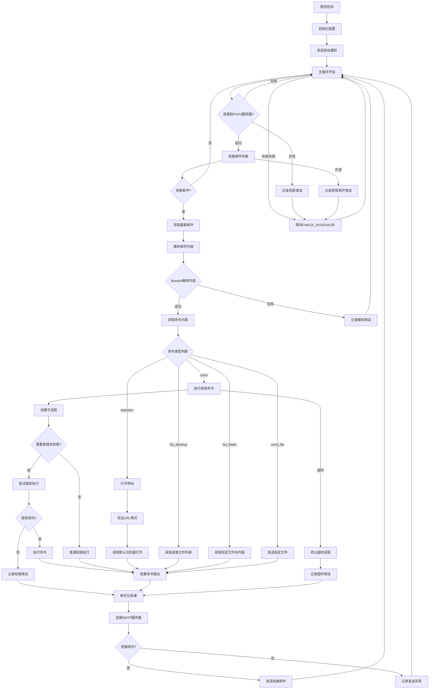

<div align="center">
  
  <h1>E-control 远程控制系统</h1>
  <p>基于电子邮件的远程控制工具</p>
  
  
  
  
</div>

## 系统概述

这是一个基于电子邮件的远程控制系统，email_controller.py在受控端长期运行，用于监控指定的电子邮件帐户中的传入命令。系统使用POP3进行命令接收，使用SMTP进行结果传输，形成了一个双向通信通道，可以通过防火墙和网络限制进行远程控制。

## 系统架构


### 核心模块架构
本系统分为四个主要功能模块，每个模块负责远程控制作的特定方面。

### 通信协议和数据流
本系统实现了一种基于电子邮件的异步通信协议，该协议支持目标设备命令和广播命令。
### 命令格式结构


### 命令类别和处理


### 设备命令过滤
设备过滤机制将确保命令仅在预期目标上执行。


## 部署与使用
### Python环境要求
该系统需要 Python 3.6+ 。
### 安装所需库
```python
pip install psutil pillow
```
### 电子邮件通信配置
* `EMAIL_ACCOUNT`：用于受控设备的电子邮件地址
* `EMAIL_PASSWORD`：受控设备的电子邮件的SMTP/POP3 授权码
* `RESULT_EMAIL`：控制端电子邮件地址
* `POP3_SERVER`：受控端邮箱POP3服务器地址（例如，“pop.yeah.net”）
* `POP3_PORT`：POP3 服务端口（通常为 110）
* `SMTP_SERVER`：受控端邮件SMTP服务器主机名（例如，“smtp.yeah.net”）
* `SMTP_PORT`：SMTP 服务端口（通常为 25 ）
  
### 运行程序
#### 1.通过python运行
导航到包含Python文件的目录，然后按住Shift键并右键单击空白处，选择“在此处打开PowerShell窗口”。在PowerShell窗口中，输入以下命令：
```powershell
python email_controller.py
```
#### 2.使用PyInstaller打包成exe文件运行
导航到包含Python文件的目录，然后按住Shift键并右键单击空白处，选择“在此处打开PowerShell窗口”。在PowerShell窗口中，输入以下命令：
```powershell
pyinstaller -F -w  email_controller.py
```
在dist目录下可以找到生成的email_controller.exe，双击运行。
