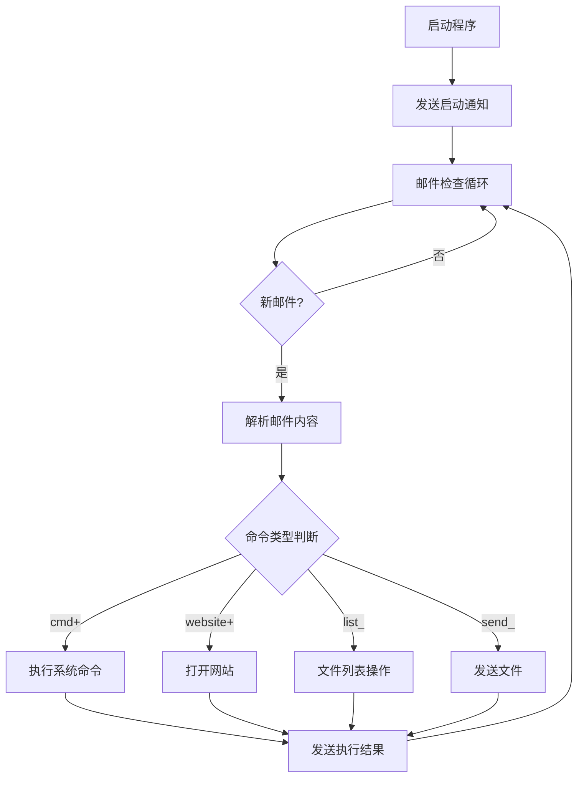

# 邮件远程控制系统

## 项目概述

这是一个基于Python的邮件远程控制系统，通过POP3协议接收命令并执行，支持系统命令执行、文件操作、网站访问等功能。系统采用模块化设计，具有良好的扩展性和可靠性。

## 系统架构



## 核心功能模块

### 1. 邮件处理模块
- **功能**：负责与邮件服务器通信，接收和解析邮件
- 主要函数：
  - `parse_email()`: 解析邮件内容和附件
  - `decode_str()`: 解码邮件主题和内容
  - `process_email_content()`: 处理邮件内容，解析命令

### 2. 命令执行模块
- **功能**：执行系统命令并返回结果
- 主要函数：
  - `execute_command()`: 执行单个命令
  - `execute_command_thread()`: 多线程执行命令
  - `run_as_admin()`: 以管理员权限运行命令
  - `terminate_process()`: 终止进程及其子进程

### 3. 文件操作模块
- **功能**：处理文件相关操作
- 主要函数：
  - `list_desktop_files()`: 列出桌面文件
  - `list_folder_files()`: 列出指定文件夹内容
  - `send_file_from_folder()`: 发送指定文件
  - `send_desktop_file()`: 发送桌面文件

### 4. 系统信息模块
- **功能**：收集和发送系统信息
- 主要函数：
  - `send_startup_info()`: 发送启动信息
  - `send_offline_notification()`: 发送下线通知
  - `is_admin()`: 检查管理员权限

## 配置参数详解

### 1. 邮箱配置
```python
# 发件邮箱配置
EMAIL_ACCOUNT = "h2o2o2o@yeah.net"  # 发件邮箱地址
EMAIL_PASSWORD = "VE9EGBtvTjZKB5UW"  # 邮箱密码/授权码

# 收件邮箱配置
RESULT_EMAIL = "1248044293@qq.com"  # 接收执行结果的邮箱

# 服务器配置
POP3_SERVER = "pop.yeah.net"  # POP3服务器地址
POP3_PORT = 110               # POP3端口
SMTP_SERVER = "smtp.yeah.net"  # SMTP服务器地址
SMTP_PORT = 25                # SMTP端口
```

### 2. 系统配置
```python
# 设备信息
DEVICE_NAME = platform.node().replace(' ', '_')  # 自动获取设备名，空格替换为下划线

# 命令执行配置
COMMAND_TIMEOUT = 50  # 命令执行超时时间(秒)
MAX_WORKERS = 5       # 最大并发命令数
CHECK_INTERVAL = 300  # 邮件检查间隔(秒)

# 重试配置
MAX_RETRIES = 3       # 最大重试次数
RETRY_DELAY = 10      # 重试间隔(秒)
```

### 3. 权限配置
```python
ADMIN_ERROR_MESSAGES = [
    "Access is denied",
    "拒绝访问",
    "管理员",
    "需要提升权限",
    "权限不足"
]
```

## 使用说明

### 1. 环境要求
- Python 3.6+
- 依赖库：
  ```
  pip install psutil pillow
  ```

### 2. 命令格式

#### 执行系统命令
```
cmd+<命令>
示例：cmd+ipconfig
```

#### 打开网站
```
website+<URL>
示例：website+www.example.com
```

#### 文件操作
```
# 列出桌面文件
list_desktop

# 列出指定文件夹内容
list_folder <文件夹路径>

# 发送文件
send_file <文件路径>
```

### 3. 启动方式
```bash
python email_controller.py
```

## 安全注意事项

1. **敏感信息保护**
   - 建议将邮箱密码等敏感信息存储在环境变量中
   - 不要将包含密码的代码提交到版本控制系统

2. **权限控制**
   - 程序会自动检测并尝试获取管理员权限
   - 谨慎执行需要特权的命令

3. **网络连接**
   - 确保网络连接稳定
   - 配置正确的防火墙规则，允许程序访问邮件服务器

## 扩展开发

### 添加新命令
1. 在`process_email_content()`函数中添加新的命令处理逻辑
2. 实现对应的处理函数
3. 更新命令格式说明文档

### 错误处理
- 所有命令执行都有try-catch包装
- 错误信息会通过邮件发送到指定邮箱

## 常见问题

1. **邮件接收失败**
   - 检查邮箱账号密码是否正确
   - 确认POP3/SMTP服务已开启
   - 检查网络连接

2. **命令执行超时**
   - 增加`COMMAND_TIMEOUT`值
   - 检查命令是否被防火墙拦截

3. **权限问题**
   - 确保程序有足够的权限执行命令
   - 检查用户账户控制(UAC)设置

## 许可证

本项目仅供学习和研究使用，请勿用于非法用途。
